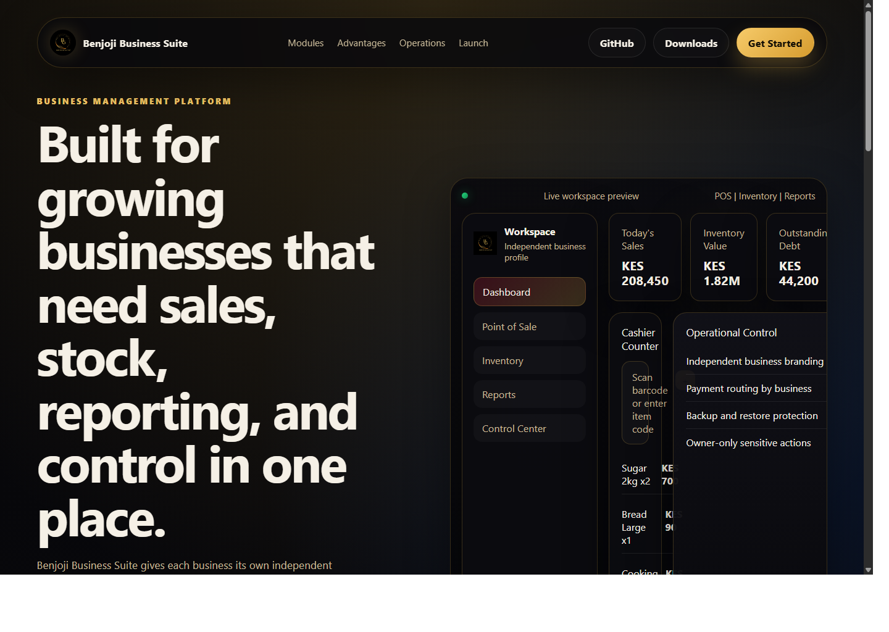
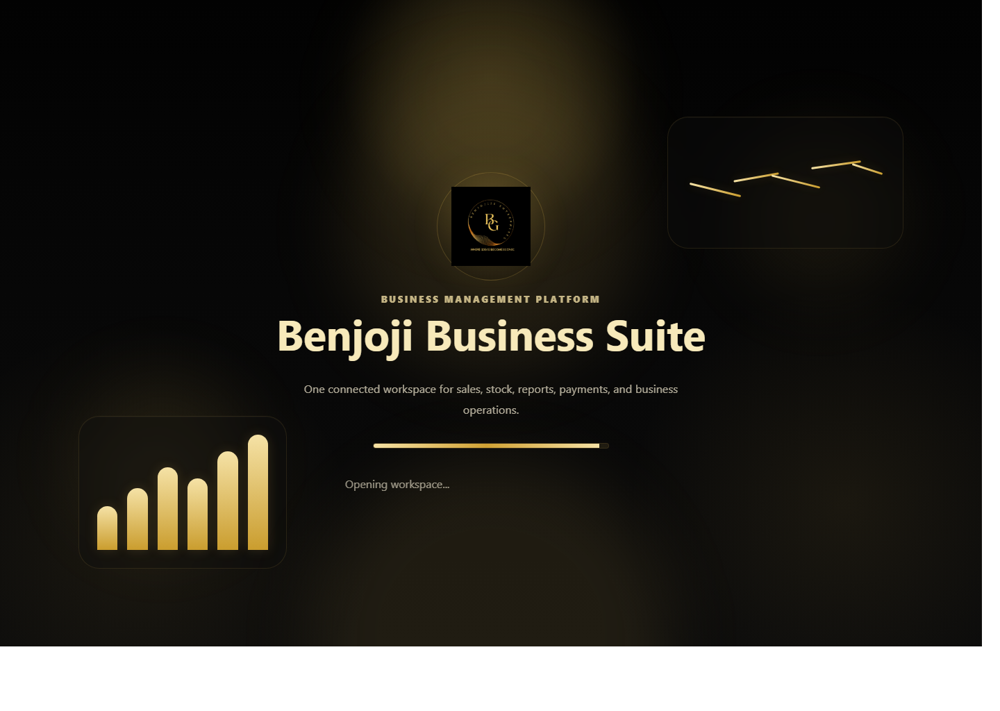
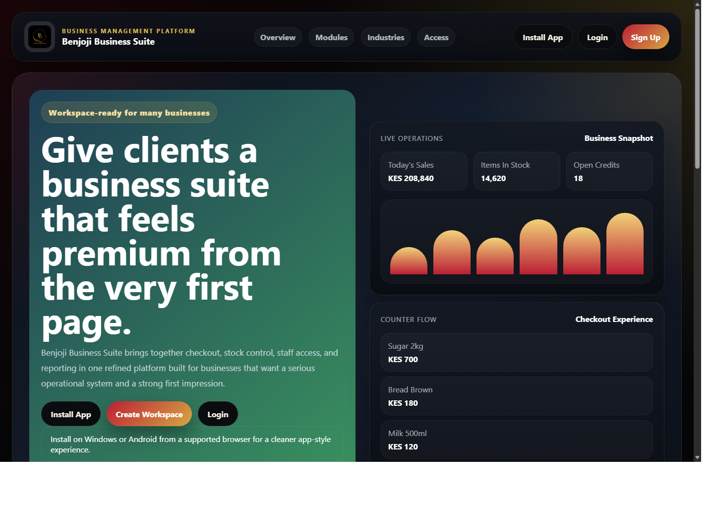

# Benjoji Business Suite

Business management platform for retail and service businesses that need point of sale, inventory, debt tracking, reporting, backups, and workspace control in one place.

[](https://github.com/georgebenedict77/benjoji-business-suite/actions/workflows/verify.yml)

[Live Demo](https://georgebenedict77.github.io/benjoji-business-suite/) | [Windows Downloads](https://github.com/georgebenedict77/benjoji-business-suite/releases) | [Source Code](https://github.com/georgebenedict77/benjoji-business-suite)

## Product Positioning

Benjoji Business Suite is built as a multi-business platform, not a single-company internal system.

- Each business gets its own workspace
- Each workspace has its own owner account, staff, logo, receipt settings, payment routing, and backups
- One client business does not depend on another client business account or data

## Problem

Many growing businesses still run daily operations across disconnected tools:

- checkout on one side
- stock records in another place
- debt follow-up done manually
- reporting delayed until end of day
- business recovery ignored until something breaks

That creates mistakes, missed payments, lost stock visibility, and weak operational control.

## Solution

Benjoji Business Suite brings the main operational flow into one platform:

- cashier point of sale
- inventory and stock movement
- invoices and receipts
- debt tracking and repayment
- daily, weekly, monthly, and annual reporting
- business branding and payment routing
- local backups and restore workflow

## Screenshots

### Public Product Site



### App Intro



### App Login / Workspace Entry



## Features

- Multi-business workspace setup
- Branded public landing page and app intro
- POS checkout with popup payment flow
- Split payments across cash, M-Pesa, Airtel Money, card, bank transfer, Buy Goods, Paybill, and gift card
- Inventory management with product codes, stock in, stock out, and stock records
- Invoice desk and receipt output
- Debt tracking and debt repayment flow
- Daily, weekly, monthly, and annual reports
- Activity calendar with daily drill-down
- Owner control center for branding, payment routing, security, compliance notes, and backups
- Workspace isolation and owner-only sensitive actions

## Architecture

### Frontend

- Vanilla JavaScript
- Single-page app shell
- Local install support through PWA files

Main frontend files:

- `public/client.js`
- `public/client.css`
- `public/index.html`

### Backend

- Node.js built-in HTTP server
- SQLite via `node:sqlite`
- Local-first workspace storage

Main backend files:

- `server.js`
- `lib/workspace-auth.js`
- `lib/workspace-business.js`
- `lib/workspace-control.js`
- `lib/workspace-db.js`

## Project Structure

```text
.github/workflows/   CI and release automation
docs/                GitHub Pages public site
lib/                 backend logic and workspace services
public/              frontend app shell and assets
screenshots/         repo screenshots for presentation
scripts/             smoke tests and packaging scripts
server.js            HTTP server and API routes
```

## Local Setup

### Requirements

- Node.js 24 or newer
- Windows PowerShell for the helper scripts

### Run

```powershell
npm start
```

or:

```powershell
.\start-app.ps1
```

Then open:

```text
http://127.0.0.1:3000
```

## Verification

Run the full local verification bundle:

```powershell
npm run verify
```

This includes:

- syntax checks
- workspace smoke test
- HTTP smoke test

## Data and Backups

The suite uses a persistent local app-data directory on Windows.

New installs prefer:

```text
C:\Users\<YourUser>\AppData\Local\Benjoji Business Suite\
```

Each workspace stores its own data under:

```text
workspaces\<workspace-id>\benjoji.sqlite
workspaces\<workspace-id>\backups\
```

## Downloads

Portable Windows builds are published through GitHub Releases:

- [Latest Releases](https://github.com/georgebenedict77/benjoji-business-suite/releases)

You can also build a local portable package with:

```powershell
npm run build:windows-portable
```

## Demo and Deployment

### Public Demo

- GitHub Pages marketing site:
  [https://georgebenedict77.github.io/benjoji-business-suite/](https://georgebenedict77.github.io/benjoji-business-suite/)

### Full App

The real business runtime still runs through the Node + SQLite app.

- local desktop use is ready now
- same-network preview is available with `.\start-lan.ps1`
- full public hosted runtime can be added later with a proper Node host

## CI

GitHub Actions now verifies the project automatically on push and pull request.

Checks include:

- `node --check server.js`
- `node --check public/client.js`
- `npm run smoke`
- `npm run smoke:http`

## License

This repository is currently distributed under the proprietary license in [LICENSE](./LICENSE).

## Changelog

Release history is tracked in [CHANGELOG.md](./CHANGELOG.md).

## Current Notes

- Payment approvals are still simulated workflow approvals until real provider credentials are connected
- Receipt printing is browser-based today, not full thermal printer integration yet

